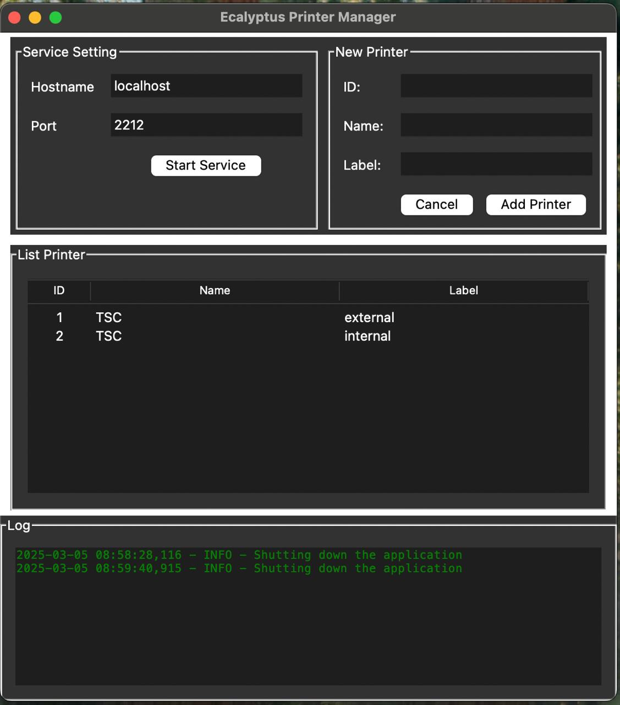

# Ecalyptus Printer Manager

This is a simple API for the [Ecalyptus Printer](https://github.com/andaniom/print-service).

## Installation

1. Clone the repository, `git clone https://github.com/andaniom/print-service.git`
2. Install InnoSetup for building Windows installers, Download the latest version from [here](https://www.jrsoftware.org/isinfo.php) 
3. Install the required packages with `pip install -r requirements.txt`
4. Run the `build.bat` script to build the application

### Structure

* `api/` - Fast API to receive print jobs
* `view/` - Tkinter Handle View
* `README.md` - This file

### Screenshot

